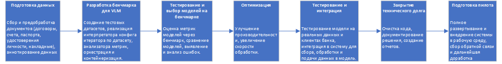
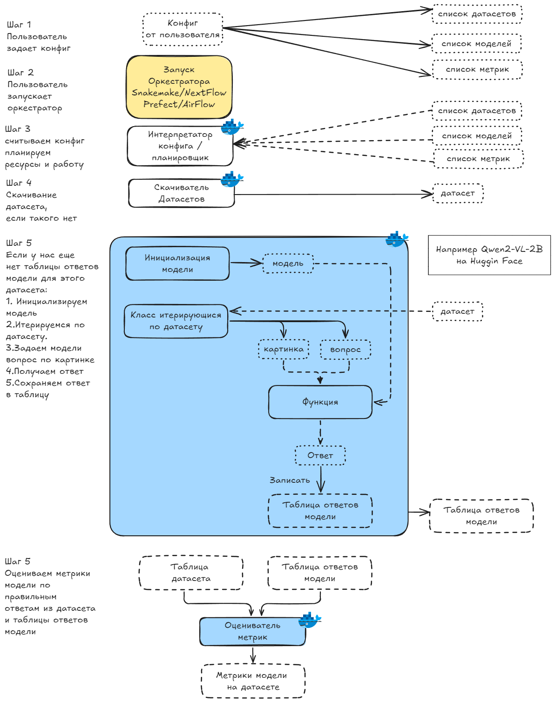

# ML System Design Doc - [RU]

> ## Термины и пояснения
> - Итерация - это все работы, которые совершаются до старта очередного пилота.
> - БТ - бизнес-требования.
> - EDA - Exploratory Data Analysis - исследовательский анализ данных.

### 1. Цели и предпосылки
#### 1.1. Зачем идем в разработку продукта?

- Бизнес-цель.

Разработка и внедрение системы на основе мультимодальных моделей для автоматизированного распознавания и классификации документов. Решение позволяет преобразовать сканы документов в структурированную информацию с помощью модели, которая, используя вопросы (промпты), извлекает ключевые данные из текстовых и визуальных элементов документа. Это повышает эффективность обработки документов и снижает затраты на ручной труд в задачах, связанных с анализом, валидацией и категоризацией документов.

- Почему станет лучше, чем сейчас, от использования ML.

Использование ML в обработке документов снизит фактор человеческой ошибки, потребность в большом штате сотрудников, повысит производительность, качество и эффективность процессов, позволяя бизнесу быстрее адаптироваться к новым задачам и масштабироваться.

- Что будем считать успехом итерации с точки зрения бизнеса.

  - Увеличение точности классификации документов: повышение точности распознавания типа документа (паспорт, договор, чек) > 95%.

  - Увеличение точности извлечения данных: извлечение ключевых полей с минимальной ошибкой <5%.

  - Уменьшение времени обработки одного документа по сравнению с текущими процессами с 5 минут до 30 секунд.

  - Снижение затрат на обработку документа на n %, что будет достигнуто за счет сокращения ручного труда.

  - Увеличение количества обработанных документов за единицу времени. Переход с 1000 до 10000 документов в день без увеличения затрат

#### 1.2. Бизнес-требования и ограничения

- Краткое описание БТ.

1. Поддержка различных типов документов: система должна работать с разнообразными форматами (сканы, фотографии, PDF, изображения), включая как структурированные (формы, таблицы), так и неструктурированные документы.

2. Точность распознавания: модели должны обеспечивать высокий уровень точности для распознавания текста и классификации документа по его типу, превышающий 95%.

3. Автоматическое извлечение данных: система должна выделять ключевые элементы с минимальным количеством ошибок.

4. Гибкость и масштабируемость: решение должно быть легко масштабируемым для обработки от нескольких тысяч до миллионов документов в месяц без существенной потери производительности.

5. Интеграция с существующими системами: возможность интеграции с ERP, CRM и другими корпоративными платформами для передачи классифицированных данных.

6. Мультимодальность: использование моделей, способных обрабатывать одновременно текстовую и визуальную информацию для улучшения классификации (например, учитывать как содержание документа, так и его визуальное оформление).

7. Юридическая и нормативная совместимость: решение должно соответствовать требованиям законодательства о защите данных.

8. Пользовательский интерфейс: система должна предоставлять простой и удобный интерфейс для настройки и мониторинга, а также для ручной проверки в случае сложных или спорных случаев.

- Бизнес-ограничения.

1. Ограничения бюджета:
Разработка, внедрение и обслуживание системы ограничены фиксированным бюджетом. Выбор технологий, оборудования и лицензий должен быть оптимальным для достижения целей, не превышая утверждённые финансовые рамки.

2. Сроки реализации:
Проект должен быть завершён в течение 6 месяцев, включая разработку, тестирование, пилотный запуск и интеграцию с текущими бизнес-системами.

3. Качество данных:
Качество входных данных (разрешение изображений, уровень шума, искажения) может значительно варьироваться. Система должна быть устойчива к этим факторам, но не всегда возможно обеспечить идеальные исходные данные.

4. Конфиденциальность данных:
Документы могут содержать конфиденциальную информацию (финансовые данные, персональные данные клиентов), что требует соблюдения строгих стандартов безопасности и защиты данных. Использование облачных решений ограничено корпоративной политикой и нормативными требованиями.

5. Региональные особенности:
Система должна поддерживать документы на нескольких языках и учитывать региональные различия в формате и содержании документов (например, различия в юридических требованиях, шаблонах счетов или контрактов).

6. Сложности в классификации:
Некоторые типы документов могут не иметь чётко определённых шаблонов или содержать сложные для обработки элементы (например, рукописный текст, необычные форматы). Это увеличивает вероятность ошибок и необходимость ручной проверки.

7. Ограничения по кадрам:
У компании может быть ограниченное количество технических специалистов для настройки, обслуживания и обучения системы, что требует создания максимально автоматизированного и интуитивного решения.

- Что мы ожидаем от конкретной итерации.

1. Работающая базовая версия системы:
В рамках данной итерации планируется завершить разработку ключевых компонентов, включая:

    - Оптимизированный процесс распознавания текста (OCR) для документов стандартного качества.
    - Классификацию документов по трём основным категориям (например, счета, контракты, справки).

2. Тестирование функциональности:
Проведение тестов на ограниченной выборке данных (100-200 документов), чтобы оценить точность классификации и извлечения данных. Ожидается достижение точности классификации не ниже 85% на этом этапе.

3. Внедрение предварительной обработки изображений:
Реализовать базовую обработку входных данных (например, удаление шумов, выравнивание документов), чтобы улучшить качество распознавания текста.

4. Сбор обратной связи:
Проведение внутреннего тестирования с привлечением ключевых пользователей. Мы ожидаем:

    - Выявление основных проблем в интерфейсе или работе системы.
    - Предложения по улучшению процесса обработки документов.

5. Документирование и анализ результатов:
Ожидается составление отчёта по итогам итерации, в котором будут:

    - Указаны достигнутые метрики и их соответствие целевым показателям.
    - Перечислены выявленные проблемы.
    - Сформирован план улучшений на следующую итерацию.

6. Готовность к масштабированию:
Результат данной итерации станет основой для работы с более сложными случаями: обработка документов низкого качества, добавление новых категорий, оптимизация классификации и точности извлечения данных.

- Описание бизнес-процесса пилота, насколько это возможно - как именно мы будем использовать модель в существующем бизнес-процессе?

Цель пилота — проверить работоспособность модели распознавания и классификации документов в реальных условиях, выявить возможные проблемы интеграции в текущие бизнес-процессы и оценить экономический эффект от внедрения.
1. Сбор и подготовка данных.
2. Интеграция модели в текущую систему.
3. Обработка данных моделью.
4. Ручная проверка и доработка.
5. Сбор метрик и анализ.

- Что считаем успешным пилотом? Критерии успеха и возможные пути развития проекта.

Успешным пилотом считается выполнение ключевых задач, которые подтверждают, что модель распознавания и классификации документов работает эффективно в реальных условиях, соответствует требованиям бизнеса и приносит ощутимую ценность.

#### 1.3. Что входит в скоуп проекта/итерации, что не входит

- На закрытие каких БТ подписываемся в данной итерации.

Что входит в скоуп проекта/итерации:
1. Распознавание текста.
2. Классификация документов.
3. Извлечение ключевых данных.
4. Пользовательский интерфейс (UI).
5. Тестирование системы.
6. Интеграция с существующей инфраструктурой.

Что не входит в скоуп данной итерации:
1. Обработка сложных типов данных.
2. Масштабирование.
3. Полная автоматизация.
4. Глубокая интеграция.
5. Поддержка дополнительных форматов (например, ZIP-архивы или CAD-файлы).

- Описание результата с точки зрения качества кода и воспроизводимости решения.

1. Качество кода:
    - Структурированность и читаемость.
    - Документированность.
    - Управление зависимостями.
    - Тестирование.
    - Логирование и обработка ошибок.

2. Воспроизводимость решения:
    - Фиксация экспериментальных условий.
    - Репликация обучения.
    - Контроль данных.
    - Контейнеризация.
    - Автоматизация.
    - Версионный контроль.

- Описание планируемого технического долга (что оставляем для дальнейшей продуктивизации)

Планируемый технический долг оставляет возможности для дальнейшего развития и масштабирования системы, обеспечивая баланс между скоростью реализации пилотного проекта и долгосрочными требованиями к продуктивному решению.

#### 1.4. Предпосылки решения

- Описание всех общих предпосылок решения, используемых в системе – с обоснованием от запроса бизнеса: какие блоки данных используем, горизонт прогноза, гранулярность модели, и др.

I. Типы данных и их обоснование.
1. Входные данные:

    - Документы в формате PDF, изображений (JPEG, PNG): Большинство документов, поступающих в компанию (счета, договоры, заявки), представлены в этих форматах, что делает их основным источником данных.

    - Сканы и фотографии документов: Значительная часть документов предоставляется в виде сканов или снимков, сделанных с мобильных устройств.

2. Атрибуты для извлечения:

    - Ключевые параметры: даты, суммы, номера документов, названия компаний, товары/услуги. Эти данные необходимы для автоматизации основных бизнес-процессов, таких как оплата счетов, регистрация договоров, анализ входящих данных.

3. Метаинформация:

    - Типы документов (счёт, акт, накладная и т.д.), источник поступления (почта, система загрузки). Классификация и маршрутизация документов критически важны для их дальнейшей обработки.

II. Гранулярность модели
1. На уровне документа:

    - Модель классифицирует документ целиком по его типу. Это позволяет направить документ в правильный бизнес-процесс (например, отправить счёт в бухгалтерию).

2. На уровне элементов документа:

    - Извлекаются конкретные атрибуты (дата, сумма, реквизиты). Эти данные используются в ключевых системах (например, для автоматической оплаты или анализа).

3. На уровне страницы:

    - Если документ многостраничный, модель анализирует каждую страницу отдельно. Многостраничные документы часто содержат разные типы информации, которые нужно обрабатывать отдельно.

III. Горизонт прогноза и интервал обработки
1. Горизонт обработки:

    - Документы должны быть обработаны в течение 1–5 минут с момента поступления. Это позволяет интегрировать решение в оперативные процессы и минимизировать задержки.

2. Частота обработки:

    - Система должна быть готова к обработке документов в режиме потока (streaming) или батчевого режима:

          Стриминг: Для входящих документов в реальном времени.
          Батч: Для обработки накопленных данных (например, архивов).

      Бизнес-процессы требуют как немедленной обработки (счета, заявки), так и периодической работы с большими объемами (архивы).

IV. Поддерживаемые категории данных и их обоснование
1. На этапе пилота:

    - Счета-фактуры, договоры, накладные. Это самые частые и значимые документы, ошибки в обработке которых критически сказываются на работе компании.

2. На этапе масштабирования:

    - Сложные документы, такие как акты сверки, технические отчёты. Эти типы данных менее часты, но их обработка важна для полноты автоматизации процессов.

V. Предположения об используемых технологиях.
1. OCR-модуль:

    - Используется мультимодальная модель, совмещающая визуальные и текстовые признаки. Комбинация текстового и визуального анализа повышает точность обработки сложных документов с таблицами, логотипами или нестандартным оформлением.

2. Модель классификации:

    - Гибридная архитектура (текст+изображение), поддерживающая обучение с использованием ограниченного набора размеченных данных. Поддержка мультимодальности соответствует структуре документов и ускоряет запуск системы.

3. Извлечение данных:

    - Используются предобученные языковые модели (например, LLM) с дообучением под задачи конкретного бизнеса. Такие модели обеспечивают высокую точность даже на ограниченном объёме данных.

### 2. Методология.

#### 2.1. Постановка задачи

- Что делаем с технической точки зрения: рекомендательная система, поиск аномалий, прогноз, оптимизация, и др.

С технической точки зрения задача заключается в разработке системы для распознавания и классификации документов с использованием мультимодальных моделей машинного обучения. Основная цель — автоматизировать процесс обработки документов, извлекая ключевые данные и классифицируя документы по заранее определённым категориям. Это позволит повысить эффективность и ускорить обработку данных в бизнес-процессах.

Из измеримых критериев и метрик, первостепенные - это
* WER - (Word Error Rate): измеряет количество ошибок на уровне слов.
* CER - CER (Character Error Rate): измеряет точность распознавания символов.
* BLEU (Bilingual Evaluation Understudy) — метрика, которая измеряет, насколько хорошо сгенерированный текст (например, результат работы модели) похож на эталонный текст.

А также вторичные, для извлечения ключевых данных и классификации документов:

    * Accuracy
    * Precision
    * Recall
    * F1-Score

Из ожидаемых результатов:

    1. WER ≤ 10%
    2. CER ≤ 5%.
    3. BLEU ≥ 0.7
    4. F1-Score ≥ 85%.
    5. Accuracy ≥ 95%.
    6. Среднее время обработки одного документа ≤ 2 секунды.

Примерный пайплайн:

        Этап 1: Документ поступает в систему.

        Этап 2: Модуль OCR извлекает текст и изображения.

        Этап 3: Модели классификации определяют тип документа.

        Этап 4: Извлекаются ключевые данные.

        Этап 5: Документ проверяется на аномалии.

        Этап 6: Документ маршрутизируется в соответствующий бизнес-процесс.

#### 2.2. Блок-схема решения

- Блок-схема для бейзлайна и основного MVP с ключевыми этапами решения задачи: подготовка данных, построение прогнозных моделей, оптимизация, тестирование, закрытие технического долга, подготовка пилота, другое.

#### 2.3. Этапы решения задачи Data Scientist
Так как проект "Распознавание и классификация документов с помощью VLM моделей" сосредоточен преимущественно на работе с датасетами и моделями, непосредственная обработка данных в традиционном понимании (например, создание новых данных или их разметка) не является основной задачей. Вместо этого акцент сделан на анализе, подготовке и стандартизации существующих датасетов для их интеграции в бенчмарк-систему.

*Этап 1 - Подготовка данных.*

Основные цели подготовки данных:
1. Определение списка используемых датасетов:
    * Проведение анализа доступных открытых и/или частных датасетов.
    * Формирование их структурированного описания, включая формат данных, объем, наличие аннотаций и другие релевантные характеристики.
2. Разработка единого формата для работы с датасетами:
    * Утверждение стандартизированного подхода к загрузке и обработке данных.
    * Создание таблицы, описывающей ключевые параметры датасета.
3. Интеграция в бенчмарк-платформу:
    * Адаптация выбранных датасетов для тестирования моделей.
    * Оценка пригодности данных для задач классификации и распознавания документов.

Таблица с используемыми датасетами:
| Название датасета   | Описание                                                                    | Ссылка                                             |
|:--------------------|:----------------------------------------------------------------------------|:---------------------------------------------------|
| MIDV           | Датасет из семейства MIDV, состоит из  фиктивных удостоверений личности | [Ссылка](http://l3i-share.univ-lr.fr/MIDV2020/midv2020.html) |
| MTVQA  | Подвыборка вопросов и картинок из MTVQA на русском языке               | [Ссылка](https://github.com/bytedance/MTVQA/tree/main)       |                                              |
| SNILSes             | Синтетические сгенерированные изображения СНИЛСов для VQA                   | NDA                                                |

Утвержденный формат датасетов:

|   data_index | split      | image_path   | question      | answer       | doc_class   | question_type   | answear_bbox   |
|-------------:|:-----------|:-------------|:--------------|:-------------|:------------|:----------------|:---------------|
|            1 | test_clean | images/1.jpg | Текст вопроса | Текст ответа | passport    | Имя             | [10,20,30,40]  |
|            1 | test_clean | images/1.jpg | Текст вопроса | Текст ответа | passport    | Фамилия         | [10,20,30,40]  |
|            2 | test_clean | images/2.jpg | Текст вопроса | Текст ответа | document    | Сумма           | [10,20,30,40]  |

*Этап 2 - Выбор прогнозных моделей.*
#### Выбранные модели.

Для тестирования и оценки производительности на этапе бенчмаркинга были выбраны следующие VLM модели:

* `Qwen2-VL-2B`
    * [Ссылка на GitHub](https://github.com/QwenLM/Qwen2-VL)
    * [Ссылка на HuggingFace](https://huggingface.co/Qwen/Qwen2-VL-2B-Instruct)
* `MiniCPM-V-2_6`
    * [Ссылка на GitHub](https://github.com/OpenBMB/MiniCPM-V)
    * [Ссылка на HuggingFace](https://huggingface.co/openbmb/MiniCPM-V-2_6)

#### Этапы тестирования VLM моделей:
    1. Отбор моделей для тестирования.
    2. Подбор промтов для моделей, выбираем оптимальный набор промтов для каждой модели.
    3. Исследование работы моделей на всевозможных данных.
        - Туда ли "смотрит" модель.
        - Правильно ли распознает текст и в каких ситуациях.
        - Поиск слабых мест и точек роста.

*Этап 3 - Выбор метрик и их связь с бизнес-результатом.*

1. `WER (Word Error Rate) ≤ 10%`
* Описание: WER измеряет процент ошибок в распознавании текста по словам, сравнивая извлеченный текст с эталонным. Метрика учитывает вставки, удаления и замены слов.
* Бизнес-результат:
    * Низкий WER указывает на точность извлечения информации, что критично для обработки документов, где ошибки в именах, суммах или датах могут привести к финансовым и юридическим рискам.
    * Порог ≤ 10% обеспечивает надежное распознавание текста, достаточное для большинства автоматизированных бизнес-процессов.
2. `CER (Character Error Rate) ≤ 5%`
* Описание: CER — это аналог WER, но вычисляется на уровне символов, а не слов. Используется в случаях, где важна точность мелких деталей (например, номеров паспортов, кодов, сумм).
* Бизнес-результат:
    * Низкий CER особенно важен для обработки числовой и кодовой информации, где ошибка даже в одном символе может привести к значительным сбоям в работе систем.
    * Порог ≤ 5% позволяет избежать критических ошибок в данных, поддерживая высокий уровень автоматизации и минимизируя ручные исправления.
3. `BLEU (Bilingual Evaluation Understudy) ≥ 0.7`
* Описание: BLEU измеряет схожесть сгенерированного текста (например, ответа на вопрос) с эталонным текстом. Используется в задачах генерации текста.
* Бизнес-результат:
    * Высокий BLEU указывает на качество мультимодальной модели в контексте задач VQA (Visual Question Answering).
    * Порог ≥ 0.7 гарантирует, что ответы на вопросы, основанные на документах, будут достаточно точными, чтобы поддерживать автоматизированное принятие решений.
4. `F1-Score ≥ 85%`
* Описание: F1-Score — это гармоническое среднее между Precision (точность) и Recall (полнота). Используется для оценки качества классификации документов.
* Бизнес-результат:
    * Высокий F1-Score важен для задач, где критично как правильно классифицировать документ, так и не пропустить релевантные категории.
    * Порог ≥ 85% обеспечивает надежную классификацию документов, сокращая необходимость ручной проверки и повышая эффективность бизнес-процессов.
5. `Accuracy ≥ 95%`
* Описание: Accuracy показывает долю правильно классифицированных или обработанных документов от общего числа документов.
* Бизнес-результат:
    * Порог ≥ 95% минимизирует ошибки в операционных процессах, таких как обработка счетов, договоров и паспортов, что повышает доверие к системе со стороны пользователей.
6. `Среднее время обработки одного документа ≤ 2 секунды`
* Описание: Эта метрика измеряет производительность системы, показывая, сколько времени требуется для обработки одного документа.
* Бизнес-результат:
    * Быстрая обработка документов критически важна для масштабируемых решений, таких как массовая обработка счетов или проверка паспортов.
    * Порог ≤ 2 секунды обеспечивает оперативность и уменьшает задержки в бизнес-процессах, улучшая пользовательский опыт.

*Этап 4 - Разработка архитектуры ПО для бенчмарка.*

1. Реализовать Итератор по датасету.

    * класс, принимающий в себя датасет в виде cvs файла
    * итерироваться по csv файлу, извлекая из него по 1 картинке и 1 вопросу по нему
    * у него есть пустой метод который принимает (модель, картинку и вопрос) -> строку ответ от модели.

2. Реализовать Оценщик метрик.

    * класс, принимающий в себя датасет в виде cvs файла(правильные ответы), cvs файл с ответами модели
    * в нем реализован счет метрик.
    * выдает метрики, Паспорт-ФИО-значение метрики. Измеряет для каждого поля отдельно

3. Реализовать Планировщик Бенчмарка.

    Считывает конфиг файл:
    * список датасетов.
    * список моделей.
    * список метрик.

4. Произвести отладочный запуск VLMEvalKit.

    VLMEvalKit — это инструмент для оценки производительности VLM (Vision-Language Models). Основная цель таких наборов инструментов — стандартизировать процесс тестирования и сравнения моделей, которые работают с мультимодальными данными.

5. Организовать реестр для хранения Docker-образов.

6. Выбор оркестратора для работы с Docker Контейнерами.

    - `Prefect 3` - В ходе тестов не удалось запустить последовательно несколько контейнеров в одной таске.
    - `AirFlow` - Инструмент невероятно гибкий. Он подходит для построения системы.
    - `NextFlow` - Инструмент достаточно гибкий. Однако вывод внутри Docker контейнеров отобразить в терминал не удалось.
Особая сложность заключается в том, что язык фреймворка - groovy.
    - `DVC` - отлично справляется с ролью оркестратора для пайплайна из Docker-контейнеров.

        Плюсы:
        * DAG реализуется
        * DVC осуществляет полный вывод терминала, работающего процесса внутри Docker-контейнера
        * осуществляется подключение папки в контейнерам
        * осуществляется подключение ГПУ в контейнерах
        * передача имен образов докер-контейнеров в качестве параметров
        * кэширование результатов выполнения шагов
        Шаги с одними и теми же параметрами не будут выполняться.
        * версионирование данных (конфигов, параметров и результатов) средствами DVC.

        Минусы:
        * работает с пайплайнами в рамках одного ПК.
